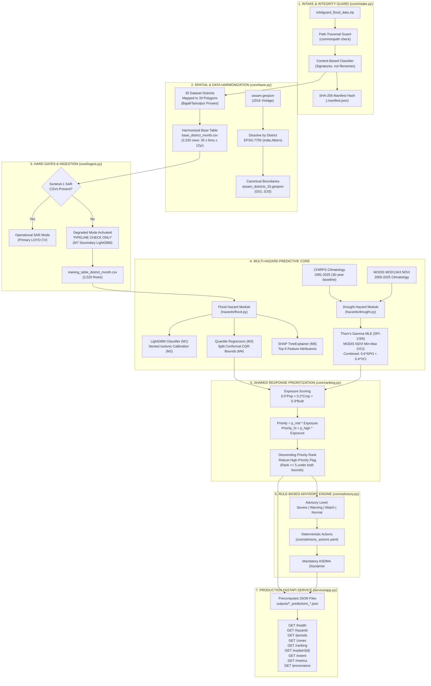

# OrbitGuard Architecture & Data Flow

```mermaid
flowchart TD
    subgraph INTAKE["1. INTAKE & INTEGRITY GUARD (core/intake.py)"]
        Z1["orbitguard_flood_data.zip"] --> Z2["Path-Traversal Guard<br/>(commonpath check)"]
        Z2 --> Z3["Content-Based Classifier<br/>(Signatures, not filenames)"]
        Z3 --> Z4["SHA-256 Manifest Hash<br/>(.manifest.json)"]
    end

    subgraph HARMONIZATION["2. SPATIAL & DATA HARMONIZATION (core/base.py)"]
        B1["assam.geojson<br/>(2016 Vintage)"] --> B2["Dissolve by District<br/>EPSG:7755 (India Albers)"]
        B2 --> B3["Canonical Boundaries<br/>assam_districts_33.geojson<br/>(G01..G33)"]
        Z3 --> B4["35 Dataset Districts<br/>Mapped to 33 Polygons<br/>(Bajali/Tamulpur Proxies)"]
        B4 --> B5["Harmonized Base Table<br/>base_district_month.csv<br/>(2,520 rows: 35 x 6mo x 12yr)"]
    end

    subgraph HARDGATES["3. HARD GATES & INGESTION (core/ingest.py)"]
        B5 --> G1{"Sentinel-1 SAR<br/>CSVs Present?"}
        G1 -- Yes --> G2["Operational SAR Mode<br/>(Primary LOYO CV)"]
        G1 -- No --> G3["Degraded Mode Activated<br/>'PIPELINE CHECK ONLY'<br/>(M7 Secondary LightGBM)"]
        G3 --> G4["training_table_district_month.csv<br/>(2,520 Rows)"]
    end

    subgraph MODELING["4. MULTI-HAZARD PREDICTIVE CORE"]
        G4 --> M1["Flood Hazard Module<br/>(hazards/flood.py)"]
        M1 --> M2["LightGBM Classifier (M1)<br/>Nested Isotonic Calibration (M2)"]
        M1 --> M3["Quantile Regressors (M3)<br/>Split-Conformal CQR Bounds (M4)"]
        M1 --> M4["SHAP TreeExplainer (M6)<br/>Top-5 Feature Attributions"]

        D1["CHIRPS Climatology<br/>1991-2025 (30-year baseline)"] --> D2["Drought Hazard Module<br/>(hazards/drought.py)"]
        D3["MODIS MOD13A3 NDVI<br/>2000-2025 Climatology"] --> D2
        D2 --> D4["Thom's Gamma MLE (SPI-1/3/6)<br/>MODIS NDVI Min-Max (VCI)<br/>Combined: 0.6*SPI3 + 0.4*VCI"]
    end

    subgraph RANKING["5. SHARED RESPONSE PRIORITIZATION (core/ranking.py)"]
        M3 --> R1["Exposure Scoring<br/>0.5*Pop + 0.2*Crop + 0.3*Built"]
        D4 --> R1
        R1 --> R2["Priority = p_mid * Exposure<br/>Priority_hi = p_high * Exposure"]
        R2 --> R3["Descending Priority Rank<br/>Robust High-Priority Flag<br/>(Rank <= 5 under both bounds)"]
    end

    subgraph ADVISORY["6. RULE-BASED ADVISORY ENGINE (core/advisory.py)"]
        R3 --> A1["Advisory Level:<br/>Severe | Warning | Watch | Normal"]
        A1 --> A2["Deterministic Actions<br/>(core/advisory_actions.yaml)"]
        A2 --> A3["Mandatory ASDMA Disclaimer"]
    end

    subgraph REST_API["7. PRODUCTION FASTAPI SERVICE (service/app.py)"]
        R3 --> S1["Precomputed JSON Files<br/>outputs/*_predictions_*.json"]
        A3 --> S1
        S1 --> S2["GET /health<br/>GET /hazards<br/>GET /periods<br/>GET /zones<br/>GET /ranking<br/>GET /explain/{id}<br/>GET /extent<br/>GET /metrics<br/>GET /provenance"]
    end
```
